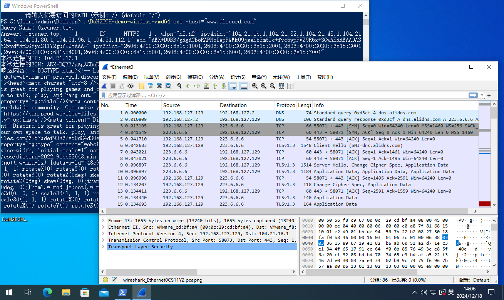
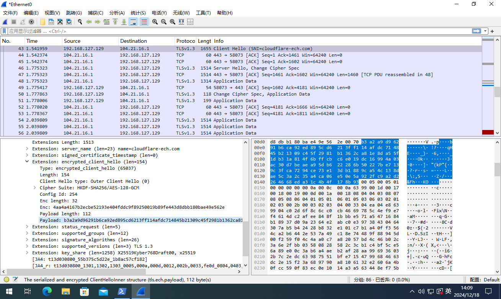
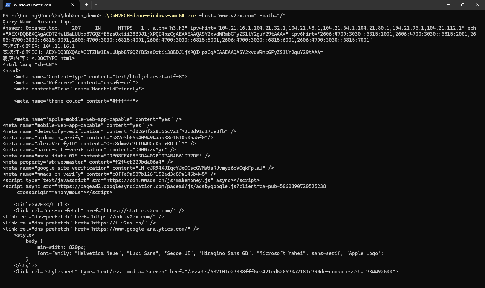
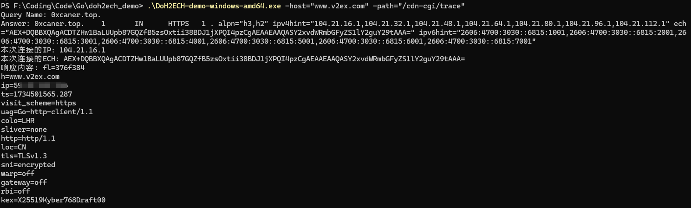

# DoH-ECH-Demo

## 介绍

使用阿里 DNS over HTTPS + Cloudflare 的 Encrypted Client Hello (Over TLS 1.3)技术实现的简单Https和Websocket请求Demo

请求过程全流量加密，目前可绕过GFW，并可用于后门流量隐藏的新型技术

需要目标网站使用了 Cloudflare CDN服务，并且未关闭ECH功能（默认开启）

```
测试站点：
www.v2ex.com
www.discord.com
www.stackoverflow.com
```

## 流量特征

以访问www.discord.com为例子

DNS：只有dns.alidns.com的请求（可更换为任意DoH服务，目前使用的是阿里DoH）



SNI: 只能看到cloudflare-ech.com:



真正的inner-client-hello包使用公钥加密在Extension中，无法被流量设备发现真实目标网站。

## 编译

```
Linux和Mac上的编译方法 (Requires go >= 1.23)
# 为 Linux 64-bit 编译
GOOS=linux GOARCH=amd64 go build -o DoH2ECH-demo-linux-amd64

# 为 Windows 64-bit 编译
GOOS=windows GOARCH=amd64 go build -o DoH2ECH-demo-windows-amd64.exe

# 为 macOS 64-bit 编译
GOOS=darwin GOARCH=amd64 go build -o DoH2ECH-demo-darwin-amd64
```

## 运行

```
Usage of DoH-ECH-http-windows-amd64.exe:
  -cdnip string
        指定要访问的CDN IP
  -domain string
        指定ECH的来源域名 (default "0xcaner.top")
  -h    显示帮助信息
  -host string
        请输入你要访问的HOST (示例: www.discord.com) (default "www.discord.com")
  -path string
        请输入你要访问的PATH (示例: /) (default "/")
```

```
.\DoH2ECH-demo-windows-amd64.exe -host="www.v2ex.com" -path="/"
等效于访问https://www.v2ex.com/
```





## 免责声明

本工具仅面向合法的学习或研究行为。在使用本工具过程中，您应确保自己所有行为符合当地的法律法规。 如您在使用本工具的过程中存在任何非法行为，您将自行承担所有后果，本工具所有开发者和所有贡献者不承担任何法律及连带责任。 除非您已充分阅读、完全理解并接受本协议所有条款，否则，请您不要安装并使用本工具。 您的使用行为或者您以其他任何明示或者默示方式表示接受本协议的，即视为您已阅读并同意本协议的约束。

## 参考资料

https://developers.cloudflare.com/ssl/edge-certificates/ech/

https://github.com/hellais/ech

https://tls-ech.dev/

https://go-review.googlesource.com/c/go/+/578575#related-content

https://github.com/golang/go/issues/63369
